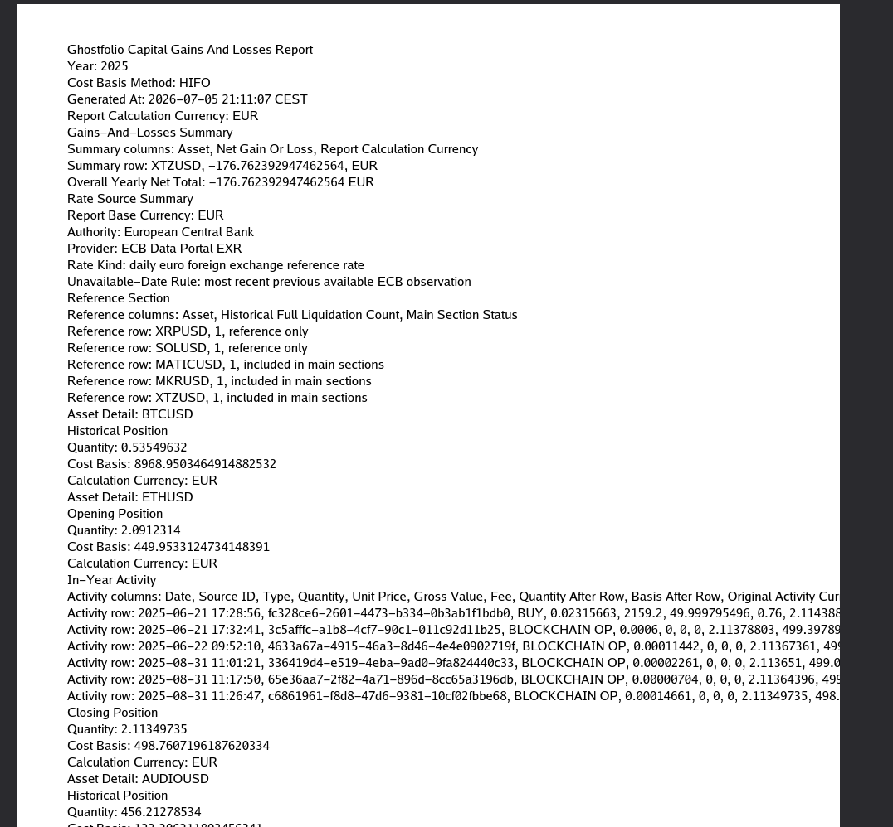
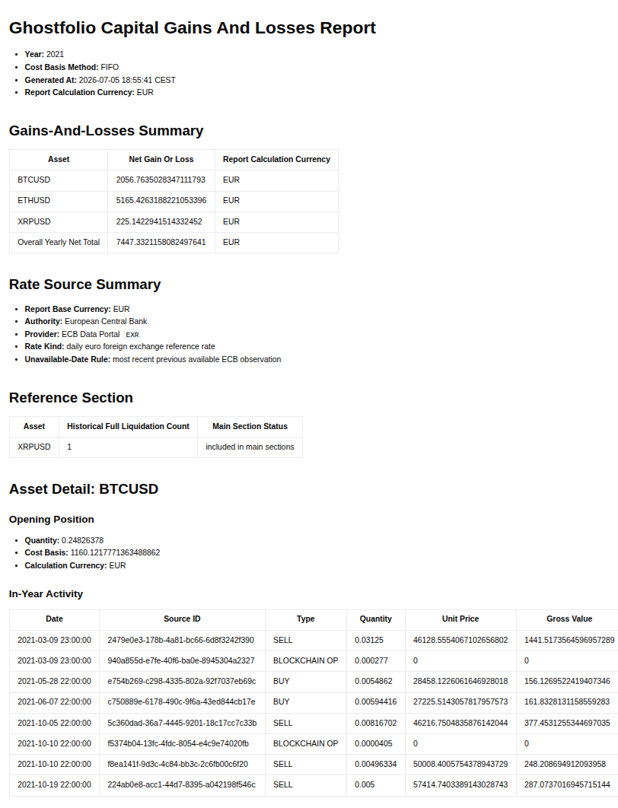

# Bugs found to report using bugfix

## [x] 1 - Markdown: general "Ghostfolio Capital Gains And Losses Report" summary section information classifier labels are not bold

Actual general summary section was
```markdown
- Year: 2025
- Cost Basis Method: Scope-Local Exact Unit Matching, otherwise Scope-Local Average Cost with Oldest-Acquired Deemed-Disposal Order
- Generated At: 2026-07-05 17:36:46 CEST
- Report Calculation Currency: EUR
```

Expected general summary section was
```markdown
- **Year:** 2025
- **Cost Basis Method:** Scope-Local Exact Unit Matching, otherwise Scope-Local Average Cost with Oldest-Acquired Deemed-Disposal Order
- **Generated At:** 2026-07-05 17:36:46 CEST
- **Report Calculation Currency:** EUR
```

## [x] 2 - PDF: Document is illegible because it is being printed in Markdown format inside the PDF

The document seems to have the correct data and structure, but it is basically a Markdown syntax document inside a PDF, making it illegible to humans because the Markdown code is printed without any interpretation.
When printing to PDF, we need to format the data in a way it is human legible when generated. Re-assess research and verify if the current option of PDF generation library can format the text correctly in a way that fits the A4 pages. 
If viable and interpreted by the library, use HTML to properly format. If not, verify other possibilities.
Pure report data and report formatting code must be isolated in their respective extension layers and most not interfere in each other (e.g. markdown formatted text should never enter the PDF layer)

## [x] 3 - PDF: Document is still illegible for humans after BUG-002

The PDF document has correctly removed the Markdown syntax from the text, but it is still illegible. The entire data is dumped in a simple line structuring with no formatting.
It should be formatted to look legible with the titles, segments and tables following the exact expectations of the properly rendered Markdown without using the Markdown language.

Actual preview of the production PDF file generated:


Expected PDF formatting (line and table sizes should fit the page, pages can be added horizontally is tables are too large)


### NON NEGOTIABLE Technical requirements:

The implementation must use `github.com/signintech/gopdf` top render tables, headings, styled text, A4 pages, custom fonts, and table rows/columns, so the layout looks the closes possible to the Markdown whent it's properly interpreted or rendered.
