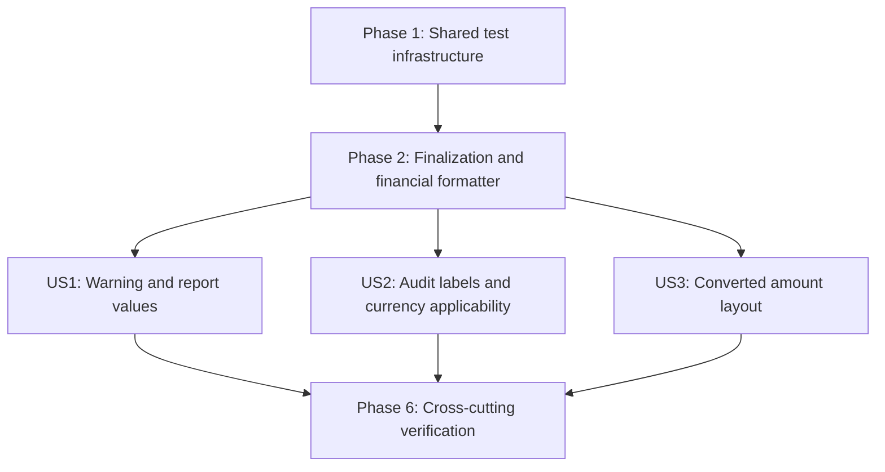

---

description: "Executable task list for final report presentation adjustments"
---

# Tasks: Final Report Adjustments

**Input**: Design documents from `/specs/009-final-report-adjustments/`

**Prerequisites**: `plan.md`, `spec.md`, `research.md`, `data-model.md`, `contracts/report-rendering.md`, and `quickstart.md`

**Tests and Quality Gates**: The feature specification explicitly requires automated package, unit, contract, integration, empirical-regression, and isolated performance evidence. New-behavior tests in each user-story phase must be written first and observed failing for the intended reason before implementation; characterization tests may pass while locking existing recovery behavior. Production statement, line, branch, and per-file coverage must remain 100%. The empirical dataset and generated oracle fixtures under `testdata/empirical/` are read-only. Explicit user-export evidence must cover local-only generation, requested owner-only permissions, cleartext and saved-path disclosure, deletion guidance, failed-attempt cleanup, non-retention, non-re-ingestion, and non-export-channel redaction.

**Organization**: Tasks are grouped by user story so each story can be implemented and tested independently after the shared prerequisites. The context-orchestration work-unit ledger is the execution control plane for parent agents and clean-context subagents.

## Format: `[ID] [P?] [Story] Description`

- **[P]**: Can run in parallel after its stated prerequisites because it uses different files and does not depend on another incomplete task in the same wave
- **[Story]**: Maps a task to User Story 1, 2, or 3 from `spec.md`
- Every task names the exact source, test, or verification path it affects

## Context Orchestration Process

### Parent Orchestrator Rules

- Execute work units in ledger order unless the ledger explicitly marks units as parallel candidates and their prerequisites are verified.
- The task checkboxes remain authoritative; a ledger unit is complete only when every referenced task is checked after parent verification.
- Use a clean subagent session for each delegated work unit.
- Include all required handoff context in the subagent prompt; do not rely on prior conversation state.
- Keep subagents inside the listed scope and require them to stop before editing outside allowed paths.
- Require fail-first behavior for test tasks: add the specified test, run it before implementation, and record that it fails for the intended missing behavior rather than a setup or compile defect. Characterization tests may pass where the task says so.
- Before starting a dependent unit, the parent must inspect diffs, run targeted verification, check for unrelated changes, and fix or re-delegate inconsistencies.
- The parent owns final validation and must rerun final gates even if a subagent helped triage command output.
- Treat `[P]` as a local implementation hint only. The ledger controls cross-unit ordering, allowed parallelism, and verification.

### Required Subagent Handoff Packet

Every delegated prompt must include:

- The work unit ID, phase, task IDs, exact checklist task descriptions, and every exact path named by those tasks.
- Relevant sources from `spec.md`, `plan.md`, `research.md`, `data-model.md`, `contracts/report-rendering.md`, and `quickstart.md`; include inherited contracts only when the referenced feature source requires them.
- Non-negotiable constraints: presentation-only HALF UP formatting from defensive exact-decimal copies; exact-value inclusion and classification decisions; unchanged quantities, rates, calculations, currencies, bundle shapes, and protected snapshots; no dependency, network, remote renderer, new persistence, report history, or automatic re-ingestion; local explicit exports retain requested `0600`, cleanup, cleartext/path disclosure, and deletion guidance; `testdata/empirical/` and generated oracle fixtures are read-only; SEC-001 permits only synthetic non-reusable test data outside contracted exports; DEP-001 requires stopping and replanning rather than adding a fallback.
- Current implementation status from every previously verified unit relevant to the work.
- Allowed edit paths from the ledger and explicit forbidden paths, including `.specify/templates/`, `testdata/empirical/`, unrelated feature artifacts, dependency files unless the task names them for no-change verification, and all implementation areas outside the unit scope.
- Tests or validation commands to run, including the expected fail-first result where applicable.
- Required final response fields: files changed, task IDs completed, tests run with results, expected failures, assumptions, and parent follow-up.

### Parent Verification Gate

For every unit, the parent must:

- Inspect `git diff -- <unit paths>` plus every extra path reported by the subagent.
- Confirm edits remain inside unit scope or are justified adjacent changes required by the referenced task, and reject unrelated changes.
- Run the ledger's targeted tests or the closest compiling package test; for fail-first units, confirm failures identify only the intended missing behavior.
- Re-read relevant contract and data-model sections whenever public report types, visible output, renderer seams, persistence, security, or diagnostics boundaries change.
- Confirm forbidden generated, empirical fixture, secret-bearing, dependency, and persistence paths remain unchanged where the feature restrictions apply. In particular, never regenerate `testdata/empirical/` or add an unplanned dependency or remote capability.
- Mark the referenced task checkboxes only after the gate passes. A subagent report alone never completes a task.

### Context Compaction Recovery

After context compaction or parent-session replacement:

- Read this orchestration process, the complete ledger, and the authoritative checklist before editing.
- Run `git status --short` and inspect existing diffs before assigning work.
- Resume at the first ledger unit with unchecked referenced tasks unless an earlier unit has a partial diff.
- Reconstruct prior state from checked tasks, current diffs, and targeted tests rather than assumptions or conversation summaries.
- Finish and verify a partial unit before opening a new clean subagent session.

### Work Unit Ledger

| Unit | Phase | Tasks | Atomic scope and touched paths | Prerequisites | Required handoff sources | Parent verification |
|------|-------|-------|--------------------------------|---------------|--------------------------|---------------------|
| WU01 | Phase 1: Setup (Shared Test Infrastructure) | T001 | Build the closed acceptance manifest and semantic counters in `tests/testutil/report_presentation_fixtures.go` while keeping `testdata/empirical/` unchanged. | None | `tasks.md`, `spec.md`, `plan.md`, `data-model.md`, `contracts/report-rendering.md` | Inspect the fixture manifest and run `go test ./tests/testutil -count=1`; confirm `testdata/empirical/` is unchanged. |
| WU02 | Phase 1: Setup (Shared Test Infrastructure) | T002 | Extend ordered PDF text-run inspection and its tests in `tests/testutil/pdf_inspection.go` and `tests/testutil/pdf_inspection_test.go`. | None; parallel candidate with WU01 | `tasks.md`, `plan.md`, `research.md`, `contracts/report-rendering.md`, `quickstart.md` | Run `go test ./tests/testutil -count=1`; inspect font, coordinate, page-box, searchable-text, and parser-error coverage. |
| WU03 | Phase 2: Foundational (Blocking Prerequisites) | T003 | Add fail-first PDF finalization tests in `internal/report/pdf/renderer_internal_test.go`. | WU01-WU02 | `tasks.md`, `spec.md`, `plan.md`, `research.md`, `contracts/report-rendering.md` | Run `go test ./internal/report/pdf -count=1` before implementation and confirm the new cases fail only because the error-returning finalization seam is missing. |
| WU04 | Phase 2: Foundational (Blocking Prerequisites) | T004 | Characterize runtime render/finalization recovery in `internal/app/runtime/report_service_internal_test.go`. | WU01-WU02; parallel candidate with WU03 | `tasks.md`, `spec.md`, `plan.md`, `contracts/report-rendering.md` | Run `go test ./internal/app/runtime -count=1`; confirm the characterization covers no writer, opener, alternate renderer, successful payload, or path, plus redacted context and retry. |
| WU05 | Phase 2: Foundational (Blocking Prerequisites) | T005 | Add exhaustive fail-first financial formatting tests in `internal/report/presentation/financial_test.go`. | WU01-WU02; parallel candidate with WU03-WU04 | `tasks.md`, `spec.md`, `research.md`, `data-model.md`, `contracts/report-rendering.md` | Run `go test ./internal/report/presentation -count=1` before implementation and confirm failures are the missing scale-2 HALF UP formatter and guards. |
| WU06 | Phase 2: Foundational (Blocking Prerequisites) | T006 | Implement error-returning PDF finalization in `internal/report/pdf/layout_contract.go`, `internal/report/pdf/gopdf_document.go`, and `internal/report/pdf/renderer.go`. | WU03-WU04 | `tasks.md`, `spec.md`, `plan.md`, `research.md`, `contracts/report-rendering.md` | Run `go test ./internal/report/pdf ./internal/app/runtime -count=1`; inspect the public seam and redacted stage error, discarded bytes, process survival, and no-output behavior. |
| WU07 | Phase 2: Foundational (Blocking Prerequisites) | T007 | Implement exact financial and optional-financial formatting in `internal/report/presentation/financial.go`. | WU05; parallel candidate with WU06 | `tasks.md`, `spec.md`, `plan.md`, `research.md`, `data-model.md`, `contracts/report-rendering.md` | Run `go test ./internal/report/presentation -count=1`; verify defensive copies, HALF UP, unsigned zero, grammar, bounds, condition masks, and nil handling against the contract. |
| WU08 | Phase 3: User Story 1 - Read Release-Ready Report Values (Priority: P1) MVP | T008 | Add fail-first shared-row financial matrix tests in `internal/report/presentation/rows_test.go`. | WU06-WU07 | `tasks.md`, `spec.md`, `data-model.md`, `contracts/report-rendering.md` | Run `go test ./internal/report/presentation -count=1` before story implementation; verify failures identify missing row financial formatting while canonical quantities/rates and source immutability remain enforced. |
| WU09 | Phase 3: User Story 1 - Read Release-Ready Report Values (Priority: P1) MVP | T009 | Add fail-first Markdown warning and financial-field tests in `internal/report/markdown/renderer_internal_test.go` and `tests/unit/report_markdown_test.go`. | WU06-WU07; parallel candidate with WU08 | `tasks.md`, `spec.md`, `data-model.md`, `contracts/report-rendering.md`, `quickstart.md` | Run `go test ./internal/report/markdown ./tests/unit -count=1` before story implementation; confirm only the intended warning or presentation assertions fail. |
| WU10 | Phase 3: User Story 1 - Read Release-Ready Report Values (Priority: P1) MVP | T010 | Add fail-first PDF recorder coverage in `internal/report/pdf/renderer_internal_test.go`. | WU06-WU07; parallel candidate with WU08-WU09 | `tasks.md`, `spec.md`, `plan.md`, `contracts/report-rendering.md` | Run `go test ./internal/report/pdf -count=1` before story implementation; confirm failures identify the missing bold warning operation or financial presentation. |
| WU11 | Phase 3: User Story 1 - Read Release-Ready Report Values (Priority: P1) MVP | T011 | Add US1 closed-manifest contracts in `tests/contract/report_rendering_values_contract_test.go`, `tests/contract/markdown_report_contract_test.go`, and `tests/contract/report_annex_contract_test.go`. | WU06-WU07; parallel candidate with WU08-WU10 | `tasks.md`, `spec.md`, `plan.md`, `contracts/report-rendering.md`, `quickstart.md` | Run `go test ./tests/contract -count=1` before story implementation; verify intended failures preserve non-empty populations, semantic fields, bold text-run evidence, rejection, and searchability. |
| WU12 | Phase 3: User Story 1 - Read Release-Ready Report Values (Priority: P1) MVP | T012 | Add runtime-backed US1 parity and model-equality checks in `tests/integration/report_value_presentation_flow_test.go`, `tests/integration/report_generation_flow_test.go`, `tests/integration/report_failure_flow_test.go`, and `tests/integration/report_cost_basis_methods_flow_test.go`. | WU06-WU07; parallel candidate with WU08-WU11 | `tasks.md`, `spec.md`, `plan.md`, `contracts/report-rendering.md`, `quickstart.md` | Run `go test ./tests/integration -count=1` before story implementation; confirm expected failures are visible-value behavior only and AUD-001 equality remains intact. |
| WU13 | Phase 3: User Story 1 - Read Release-Ready Report Values (Priority: P1) MVP | T013, T016 | Add the shared legal warning and Markdown warning/direct financial rendering in `internal/report/presentation/legal_warning.go`, `internal/report/markdown/renderer.go`, `internal/report/markdown/renderer_summary.go`, and `internal/report/markdown/renderer_details.go`. | WU08-WU12 | `tasks.md`, `spec.md`, `plan.md`, `data-model.md`, `contracts/report-rendering.md` | Run `go test ./internal/report/markdown ./tests/unit -count=1`; inspect exact standalone bold placement, direct financial values, exact-sign inclusion, canonical quantities, and any still-expected row-builder failures assigned to WU15. |
| WU14 | Phase 3: User Story 1 - Read Release-Ready Report Values (Priority: P1) MVP | T014 | Add the dedicated measured bold wrapped-paragraph PDF operation in `internal/report/pdf/layout_contract.go` and `internal/report/pdf/gopdf_document.go`. | WU08-WU12; parallel candidate with WU13 | `tasks.md`, `spec.md`, `plan.md`, `research.md`, `contracts/report-rendering.md` | Run `go test ./internal/report/pdf -count=1`; verify operation ordering, full bold-font use, and measured vertical advance, allowing only recorded main-report integration failures assigned to WU16. |
| WU15 | Phase 3: User Story 1 - Read Release-Ready Report Values (Priority: P1) MVP | T015 | Apply shared monetary formatting to format-neutral rows in `internal/report/presentation/rows.go`. | WU08-WU12; parallel candidate with WU13-WU14 | `tasks.md`, `spec.md`, `plan.md`, `data-model.md`, `contracts/report-rendering.md` | Run `go test ./internal/report/presentation -count=1`; verify all row monetary fields, contextual errors, quantity/rate preservation, and source immutability. |
| WU16 | Phase 3: User Story 1 - Read Release-Ready Report Values (Priority: P1) MVP | T017 | Integrate the warning and direct financial formatting into `internal/report/pdf/main_report.go`. | WU13-WU15 | `tasks.md`, `spec.md`, `plan.md`, `contracts/report-rendering.md`, `quickstart.md` | Run `go test ./internal/report/presentation ./internal/report/markdown ./internal/report/pdf ./tests/unit ./tests/contract ./tests/integration -count=1`; verify the complete US1 slice and re-read warning and financial contracts. |
| WU17 | Phase 4: User Story 2 - Interpret Audit Values Clearly (Priority: P2) | T018 | Add fail-first inherited-classification presentation and Markdown fixtures in `internal/report/presentation/rows_test.go` and `tests/unit/report_markdown_test.go`. | WU16 for shared-file serialization; semantic foundation is WU06-WU07 | `tasks.md`, `spec.md`, `plan.md`, `data-model.md`, `contracts/report-rendering.md` | Run `go test ./internal/report/presentation ./tests/unit -count=1` before US2 implementation; verify missing classification propagation/currency display fails without adding upstream classification tests. |
| WU18 | Phase 4: User Story 2 - Interpret Audit Values Clearly (Priority: P2) | T019 | Add fail-first audit-entry propagation and clone tests in `internal/report/calculate/calculator_internal_test.go` and `internal/report/model/report_internal_test.go`. | WU06-WU07; parallel candidate with WU17 because paths are independent | `tasks.md`, `spec.md`, `plan.md`, `data-model.md` | Run `go test ./internal/report/model ./internal/report/calculate -count=1` before US2 implementation; confirm failures identify the missing transient classification only. |
| WU19 | Phase 4: User Story 2 - Interpret Audit Values Clearly (Priority: P2) | T020 | Add fail-first shared-row and Markdown boolean/currency tests in `internal/report/presentation/rows_test.go` and `internal/report/markdown/renderer_internal_test.go`. | WU17; parallel candidate with WU18 | `tasks.md`, `spec.md`, `data-model.md`, `contracts/report-rendering.md` | Run `go test ./internal/report/presentation ./internal/report/markdown -count=1` before US2 implementation; verify intended `Yes`/`No` and classified-currency failures only. |
| WU20 | Phase 4: User Story 2 - Interpret Audit Values Clearly (Priority: P2) | T021 | Add generated Markdown/PDF Annex contracts in `tests/contract/report_annex_contract_test.go`. | WU19 | `tasks.md`, `spec.md`, `contracts/report-rendering.md`, `quickstart.md` | Run `go test ./tests/contract -count=1` before US2 implementation; confirm failures cover both booleans, non-empty `Z`/`N`, and exact currency controls. |
| WU21 | Phase 4: User Story 2 - Interpret Audit Values Clearly (Priority: P2) | T022 | Add runtime-backed Annex parity and AUD-001 checks in `tests/integration/report_audit_presentation_flow_test.go`. | WU06-WU07; parallel candidate with WU17-WU20 because its edit path is independent | `tasks.md`, `spec.md`, `plan.md`, `contracts/report-rendering.md` | Run `go test ./tests/integration -count=1` before US2 implementation; confirm intended visible-cell failures and unchanged model currency/classification. |
| WU22 | Phase 4: User Story 2 - Interpret Audit Values Clearly (Priority: P2) | T023 | Add and defensively copy the transient classification in `internal/report/model/audit_activity_entry.go`. | WU17-WU21 | `tasks.md`, `spec.md`, `plan.md`, `data-model.md` | Run `go test ./internal/report/model -count=1`; inspect the public report model boundary and confirm no persistence or unrelated validation change. |
| WU23 | Phase 4: User Story 2 - Interpret Audit Values Clearly (Priority: P2) | T024 | Copy the inherited classification into audit entries in `internal/report/calculate/artifacts.go`. | WU22 | `tasks.md`, `spec.md`, `plan.md`, `research.md`, `data-model.md` | Run `go test ./internal/report/calculate -count=1`; verify no recomputation, sync admission, financial calculation, currency identity, or inclusion change. |
| WU24 | Phase 4: User Story 2 - Interpret Audit Values Clearly (Priority: P2) | T025 | Derive shared `Yes`/`No` and classified visible-currency presentation in `internal/report/presentation/rows.go` and consume it in `internal/report/markdown/renderer_annex.go`. | WU22; parallel candidate with WU23 | `tasks.md`, `spec.md`, `plan.md`, `data-model.md`, `contracts/report-rendering.md`, `quickstart.md` | After WU23 is also verified, run `go test ./internal/report/model ./internal/report/calculate ./internal/report/presentation ./internal/report/markdown ./tests/unit ./tests/contract ./tests/integration -count=1`; verify complete US2 behavior and AUD-001 equality. |
| WU25 | Phase 5: User Story 3 - Scan Converted Amounts (Priority: P3) | T026 | Add fail-first ordered logical-entry tests in `internal/report/presentation/converted_amounts_test.go`. | WU24 for ledger serialization; semantic foundation is WU06-WU07 | `tasks.md`, `spec.md`, `research.md`, `data-model.md`, `contracts/report-rendering.md` | Run `go test ./internal/report/presentation -count=1` before US3 implementation; verify failures identify the missing ordered entry representation and formatting only. |
| WU26 | Phase 5: User Story 3 - Scan Converted Amounts (Priority: P3) | T027 | Add fail-first Markdown converted-entry tests in `internal/report/markdown/renderer_internal_test.go`. | WU24; parallel candidate with WU25 | `tasks.md`, `spec.md`, `plan.md`, `contracts/report-rendering.md` | Run `go test ./internal/report/markdown -count=1` before US3 implementation; confirm failures concern controlled `;<br>` boundaries, spacing, and escaping. |
| WU27 | Phase 5: User Story 3 - Scan Converted Amounts (Priority: P3) | T028 | Add fail-first PDF multiline measurement, preflight, drawing, pagination, and failure tests in `internal/report/pdf/renderer_internal_test.go`. | WU24; parallel candidate with WU25-WU26 | `tasks.md`, `spec.md`, `plan.md`, `research.md`, `contracts/report-rendering.md` | Run `go test ./internal/report/pdf -count=1` before US3 implementation; confirm failures identify missing newline-preserving measurement or whole-row preflight, not generic sanitization regressions. |
| WU28 | Phase 5: User Story 3 - Scan Converted Amounts (Priority: P3) | T029 | Add concrete converted-amount contracts in `tests/contract/report_converted_amounts_contract_test.go` and `tests/contract/report_annex_contract_test.go`. | WU24; parallel candidate with WU25-WU27 | `tasks.md`, `spec.md`, `contracts/report-rendering.md`, `quickstart.md` | Run `go test ./tests/contract -count=1` before US3 implementation; verify intended `C`/`E`, subsequence, semantic-cell, Y-coordinate, order, and searchable-text failures. |
| WU29 | Phase 5: User Story 3 - Scan Converted Amounts (Priority: P3) | T030 | Add runtime-backed US3 parity, immutability, call-count, failure, and retry checks in `tests/integration/report_converted_amounts_flow_test.go`. | WU24; parallel candidate with WU25-WU28 | `tasks.md`, `spec.md`, `plan.md`, `contracts/report-rendering.md` | Run `go test ./tests/integration -count=1` before US3 implementation; confirm expected multiline behavior failures retain no-output/no-opener and successful retry evidence. |
| WU30 | Phase 5: User Story 3 - Scan Converted Amounts (Priority: P3) | T031 | Replace delimiter-bearing presentation with immutable ordered entries in `internal/report/presentation/rows.go` and `internal/report/presentation/converted_amounts.go`. | WU25-WU29 | `tasks.md`, `spec.md`, `plan.md`, `research.md`, `data-model.md`, `contracts/report-rendering.md` | Run `go test ./internal/report/presentation -count=1`; verify exact zero-to-zero omission, supported-kind order, two-place values, component errors, and no new list validation. |
| WU31 | Phase 5: User Story 3 - Scan Converted Amounts (Priority: P3) | T032 | Escape components and join controlled Markdown entries in `internal/report/markdown/renderer_conversion.go` and `internal/report/markdown/renderer_format.go`. | WU30 | `tasks.md`, `spec.md`, `plan.md`, `contracts/report-rendering.md` | Run `go test ./internal/report/markdown -count=1`; inspect escape-before-assembly ordering, valid table cells, and delimiter-free empty/singleton output. |
| WU32 | Phase 5: User Story 3 - Scan Converted Amounts (Priority: P3) | T033 | Preserve only renderer-controlled PDF newlines in `internal/report/pdf/annex_report.go` and `internal/report/pdf/presentation.go`. | WU30; parallel candidate with WU31 | `tasks.md`, `spec.md`, `plan.md`, `research.md`, `contracts/report-rendering.md` | Run `go test ./internal/report/pdf -count=1`; verify dedicated cell sanitization and `;\n` joining while allowing only measurement/pagination failures assigned to WU33. |
| WU33 | Phase 5: User Story 3 - Scan Converted Amounts (Priority: P3) | T034 | Implement drawing-equivalent PDF measurement and whole-row preflight in `internal/report/pdf/gopdf_seams.go`, `internal/report/pdf/gopdf_document.go`, and `internal/report/pdf/gopdf_table.go`. | WU31-WU32 | `tasks.md`, `spec.md`, `plan.md`, `research.md`, `contracts/report-rendering.md`, `quickstart.md` | Run `go test ./internal/report/presentation ./internal/report/markdown ./internal/report/pdf ./tests/contract ./tests/integration -count=1`; verify complete US3 behavior, fresh-page relocation, continuation context, bottom margin, and overheight failure before finalization. |
| WU34 | Phase 6: Polish & Cross-Cutting Concerns | T035 | Complete output-transaction regression tests in `internal/report/output/writer_internal_test.go` and `tests/contract/report_output_contract_test.go`. | WU33 | `tasks.md`, `spec.md`, `plan.md`, `contracts/report-rendering.md`, `quickstart.md` | Run `go test ./internal/report/output ./tests/contract -count=1`; verify `0600`, collision retention, current-attempt cleanup, no partial paths, and opener-warning retention. |
| WU35 | Phase 6: Polish & Cross-Cutting Concerns | T036 | Add SEC-001 confidentiality and delimiter-injection contracts in `tests/contract/report_rendering_confidentiality_test.go`. | WU33; parallel candidate with WU34 | `tasks.md`, `spec.md`, `plan.md`, `research.md`, `contracts/report-rendering.md`, `quickstart.md` | Run `go test ./tests/contract -count=1`; inspect synthetic sentinels and confirm prohibited material is absent from non-export channels, examples, and fixtures. |
| WU36 | Phase 6: Polish & Cross-Cutting Concerns | T037 | Add fail-first export disclosure, deletion, and state-clearing tests in `internal/tui/component/component_internal_test.go`, `internal/tui/screen/report_screen_internal_test.go`, `internal/tui/flow/model_internal_test.go`, and `tests/contract/report_generation_workflow_contract_test.go`. | WU33; parallel candidate with WU34-WU35 | `tasks.md`, `spec.md`, `plan.md`, `data-model.md`, `contracts/report-rendering.md` | Run `go test ./internal/tui/component ./internal/tui/screen ./internal/tui/flow ./tests/contract -count=1` before T038 and confirm failures are the missing copy/state behavior only. |
| WU37 | Phase 6: Polish & Cross-Cutting Concerns | T038 | Implement shared cleartext-export and deletion-guidance copy in `internal/tui/component/workflow_copy.go` and `internal/tui/screen/report_screen.go`. | WU36 | `tasks.md`, `spec.md`, `plan.md`, `data-model.md`, `contracts/report-rendering.md`, `quickstart.md` | Run `go test ./internal/tui/component ./internal/tui/screen ./internal/tui/flow ./tests/contract -count=1`; verify normal and opener-warning success list every path and exiting retains no report/path state. |
| WU38 | Phase 6: Polish & Cross-Cutting Concerns | T039 | Update the isolated scale fixture and assertions in `tests/performance/helpers_test.go` and `tests/performance/report_performance_flow_test.go`. | WU33; parallel candidate with WU34-WU37 | `tasks.md`, `spec.md`, `plan.md`, `contracts/report-rendering.md`, `quickstart.md` | Run `make test-performance`; verify exact fixture composition, 6,666 rows per format, separate timers, multiline continuation evidence, environment data, and no performance coverage artifact. |
| WU39 | Phase 6: Polish & Cross-Cutting Concerns | T040, T041 | Freeze calculation regression identities for `internal/report/basis/`, `internal/report/calculate/`, and `tests/empirical/` and add aggregate acceptance accounting in `tests/contract/testdata/report_calculation_regression_baseline.txt`, `tests/contract/report_calculation_regression_contract_test.go`, and `tests/contract/report_rendering_acceptance_test.go`. | WU33; parallel candidate with WU34-WU38 | `tasks.md`, `spec.md`, `plan.md`, `contracts/report-rendering.md`, `quickstart.md` | Run `go test ./tests/contract -count=1`; verify fixed baseline fingerprints, both attempts for all closed cases, failed-attempt denominators, all non-empty populations, and unchanged empirical fixtures. |
| WU40 | Phase 6: Polish & Cross-Cutting Concerns | T042 | Inventory, format, document, co-author, and scope-review all current agent-touched declarations across `internal/report/presentation/`, `internal/report/markdown/`, `internal/report/pdf/`, `internal/report/model/`, `internal/report/calculate/`, `internal/app/runtime/`, `internal/tui/`, `tests/`, and `tests/contract/`. | WU34-WU39 | `tasks.md`, `plan.md`, `quickstart.md`, `AGENTS.md` | Regenerate the diff inventory against `origin/main`, run `gofmt` over its Go files, run `git diff --check`, inspect every touched declaration for required docs/co-authoring, and reject unrelated changes. |
| WU41 | Phase 6: Polish & Cross-Cutting Concerns | T043, T044, T045, T046, T047, T048 | Parent-only final gate over `specs/009-final-report-adjustments/quickstart.md`, `internal/report/model/`, `internal/report/calculate/`, `internal/report/presentation/`, `internal/report/markdown/`, `internal/report/pdf/`, `internal/tui/component/`, `internal/tui/screen/`, `tests/testutil/`, `cmd/`, `internal/`, `tests/unit/`, `tests/contract/`, `tests/integration/`, `tests/empirical/`, `tools/`, `tests/performance/`, `dist/coverage.out`, `go.mod`, `go.sum`, `specs/009-final-report-adjustments/research.md`, `specs/009-final-report-adjustments/plan.md`, `specs/009-final-report-adjustments/spec.md`, and `specs/009-final-report-adjustments/tasks.md`. | WU40 | `tasks.md`, `spec.md`, `plan.md`, `research.md`, `data-model.md`, `contracts/report-rendering.md`, `quickstart.md`, `AGENTS.md` | Parent runs the focused command from `quickstart.md`, `make test`, `make coverage`, `make test-performance`, and `make quality QUALITY_BASE_REF=origin/main`, confirms `go.mod`, `go.sum`, empirical fixtures, and performance coverage boundaries are unchanged, then performs the complete manual readability, export, persistence-N/A, and security review without ACC-002 claims. |
| WU42 | Phase 6: Polish & Cross-Cutting Concerns | T049 | Parent-only final diff inventory, format, documentation, co-authoring, and no-unrelated-change audit. No explicit path in task; parent must constrain before delegation. | WU41 | `tasks.md`, `plan.md`, `quickstart.md`, `AGENTS.md` | Regenerate the branch-diff inventory against `origin/main`, inspect every agent-touched Go declaration, run `gofmt` and `git diff --check`, then rerun every WU41 gate affected by a correction before checking T049. |

## Phase 1: Setup (Shared Test Infrastructure)

**Purpose**: Establish reusable deterministic acceptance fixtures and concrete PDF inspection evidence needed by all three stories.

- [ ] T001 Create the finalized closed acceptance case manifest, semantic occurrence keys, both-format attempts, and non-empty `A`, `W`, `V`, `M`, `Q`, `B`, `Z`, `N`, `C`, `P`, and `E` counters in `tests/testutil/report_presentation_fixtures.go`, including already-classified and unclassified Annex activity controls under FR-013 and FR-015, without changing `testdata/empirical/`
- [ ] T002 [P] Extend generated-PDF inspection with ordered text runs containing page number, decoded text, font resource, and text coordinates while preserving existing page-box and searchable-text behavior, and cover parsing/error branches in `tests/testutil/pdf_inspection.go` and `tests/testutil/pdf_inspection_test.go`

**Checkpoint**: Shared fixtures can identify every acceptance occurrence, and project-owned PDF inspection can prove font and vertical-position contracts.

---

## Phase 2: Foundational (Blocking Prerequisites)

**Purpose**: Add the error-returning PDF finalization seam and exact report-specific financial formatter required before any story implementation.

**CRITICAL**: Complete this phase before starting user-story implementation.

### Tests for Foundational Behavior

> Write these tests first. T003 and T005 must fail for the missing behavior; T004 characterizes existing runtime recovery and may pass before the finalization seam changes.

- [ ] T003 [P] Add failing package tests for PDF byte-finalization success and injected failure, including normal error return, discarded partial bytes, no process termination, and no successful payload in `internal/report/pdf/renderer_internal_test.go`
- [ ] T004 [P] Add runtime-service characterization tests proving a render or finalization error invokes neither the bundle writer, opener, nor alternate-format renderer, reports no successful document or path, identifies the failed stage and applicable semantic context with a redacted cause, and permits a successful second attempt through the same service in `internal/app/runtime/report_service_internal_test.go`
- [ ] T005 [P] Add exhaustive failing tests for scale-2 HALF UP formatting, signed and non-negative vectors, nil preservation, negative-zero normalization, source immutability, accepted adjusted-exponent bounds, upper-bound carry rejection, checked `uint32` precision arithmetic, non-finite values, and unexpected decimal conditions in `internal/report/presentation/financial_test.go`

### Implementation for Foundational Behavior

- [ ] T006 [P] Change `pdfLayoutDocument.Bytes` to return `([]byte, error)`, finalize through `GetBytesPdfReturnErr`, and propagate a redacted error identifying the PDF-finalization stage from `Renderer.Render` in `internal/report/pdf/layout_contract.go`, `internal/report/pdf/gopdf_document.go`, and `internal/report/pdf/renderer.go`
- [ ] T007 [P] Implement report-domain financial and optional-financial formatting from defensive `apd.Decimal` copies at exponent `-2` with `apd.RoundHalfUp`, checked precision/exponent guards, accepted condition masks, fixed-point grammar, and unsigned zero output in `internal/report/presentation/financial.go`

**Checkpoint**: PDF finalization cannot terminate the process, and both renderers can derive exact two-place financial strings without mutating calculated values.

---

## Phase 3: User Story 1 - Read Release-Ready Report Values (Priority: P1) MVP

**Goal**: Add the exact fully bold legal-use warning and apply two-place HALF UP presentation to every visible amount and unit price while preserving quantities, rates, currencies, calculations, and exact inclusion decisions.

**Independent Test**: Generate the same representative calculated report as Markdown and PDF with the complete financial matrix, quantity vectors, and normalized rate vectors. Verify the warning exactly once between metadata and summary, every present amount and unit price at two places, nil values blank, quantities and rates canonical, source models unchanged, and out-of-domain values rejected before output.

### Tests for User Story 1

> Write these tests first and verify they fail for the missing warning or presentation behavior.

- [ ] T008 [P] [US1] Extend shared-row tests across every activity, liquidation, Annex, and conversion monetary field while proving optional blanks, exact-zero decisions, canonical quantities and rates, contextual errors, and unchanged source decimals in `internal/report/presentation/rows_test.go`
- [ ] T009 [P] [US1] Add Markdown package and black-box tests for the exact one-line bold warning, semantic placement, every direct and row-built financial field, matrix vectors, blank optionals, unchanged quantities/rates, and render failures in `internal/report/markdown/renderer_internal_test.go` and `tests/unit/report_markdown_test.go`
- [ ] T010 [P] [US1] Add PDF recorder tests for metadata-warning-summary operation order, a dedicated fully bold wrapped-warning operation, exact semantic cells, direct and row-built matrix values, unchanged quantities/rates, and layout-operation error propagation in `internal/report/pdf/renderer_internal_test.go`
- [ ] T011 [P] [US1] Add closed-manifest contract coverage for `W`, `V`, `Q`, and US1 parity items, update invalidated legacy Markdown/Annex value assertions, and verify exact fields, PDF text-run font evidence through the final warning period, both-format FR-004a rejection, population numerator/denominator reporting, and searchable/selectable content in `tests/contract/report_rendering_values_contract_test.go`, `tests/contract/markdown_report_contract_test.go`, and `tests/contract/report_annex_contract_test.go`
- [ ] T012 [P] [US1] Add runtime-backed same-cache Markdown/PDF generation checks with pre-render and post-render AUD-001 model equality for financial values, quantities, rates, rate metadata, currencies, inclusion states, and output bundle shapes, and update only invalidated rendered-value assertions before source changes in `tests/integration/report_value_presentation_flow_test.go`, `tests/integration/report_generation_flow_test.go`, `tests/integration/report_failure_flow_test.go`, and `tests/integration/report_cost_basis_methods_flow_test.go`

### Implementation for User Story 1

- [ ] T013 [P] [US1] Define the exact shared legal-use warning and emit it once as a standalone bold Markdown paragraph after report metadata and before the summary, excluding the separate Annex, in `internal/report/presentation/legal_warning.go` and `internal/report/markdown/renderer.go`
- [ ] T014 [P] [US1] Add a dedicated bold wrapped-paragraph operation with measured vertical advance and complete bold-font use to the PDF layout contract and concrete adapter in `internal/report/pdf/layout_contract.go` and `internal/report/pdf/gopdf_document.go`
- [ ] T015 [P] [US1] Replace canonical monetary rendering with the shared financial formatter for activity, liquidation, Annex activity, and converted amount values while retaining canonical quantity/rate handling and contextual field errors in `internal/report/presentation/rows.go`
- [ ] T016 [P] [US1] Apply shared financial formatting to Markdown summary totals and position cost bases, keep summary inclusion based on the exact decimal sign, and retain canonical position quantities in `internal/report/markdown/renderer_summary.go` and `internal/report/markdown/renderer_details.go`
- [ ] T017 [US1] Insert the shared warning through the bold PDF operation and apply shared financial formatting to PDF summary totals and position cost bases while keeping exact-sign inclusion and canonical quantities in `internal/report/pdf/main_report.go`

**Checkpoint**: User Story 1 passes independently in both formats and is the suggested MVP implementation/demo slice; it is not merge- or release-complete until the full selected feature and required cross-cutting gates pass.

---

## Phase 4: User Story 2 - Interpret Audit Values Clearly (Priority: P2)

**Goal**: Render structured Annex booleans as `Yes` or `No` and suppress only the visible original currency for an exact pre-format zero-priced holding reduction.

**Independent Test**: Generate both formats with true and false liquidation states plus already-classified and unclassified Annex activity controls. Verify the labels, blank/retained original currency, retained calculation currency, and unchanged pre-format audit model without retesting upstream classification or sync admission.

### Tests for User Story 2

> Write these tests first and verify they fail for missing classification propagation or incorrect visible labels/currency.

- [ ] T018 [P] [US2] Add presentation fixtures supplied with inherited `IsZeroPricedHoldingReduction` true and false values, including an unclassified tiny-positive control that displays as `0.00`, and verify only classified Annex rows blank visible activity currency without adding classification-predicate or sync-admission tests in `internal/report/presentation/rows_test.go` and `tests/unit/report_markdown_test.go`
- [ ] T019 [P] [US2] Add tests proving `AuditActivityEntry` receives and clones the inherited zero-priced classification while retaining its pre-format `ActivityCurrency` and every other audit value in `internal/report/calculate/calculator_internal_test.go` and `internal/report/model/report_internal_test.go`
- [ ] T020 [US2] Add shared-row and Markdown renderer tests for exact `Yes`/`No` mapping, direct consumption of the shared label, and blank-only-when-classified original currency while calculation currency and unclassified controls remain visible in `internal/report/presentation/rows_test.go` and `internal/report/markdown/renderer_internal_test.go`
- [ ] T021 [US2] Extend generated Markdown and concrete PDF Annex contracts for both boolean states and all `Z`/`N` currency controls, including non-empty population counts and no lowercase boolean field values, in `tests/contract/report_annex_contract_test.go`
- [ ] T022 [P] [US2] Add runtime-backed Annex parity and AUD-001 equality checks proving only the visible classified currency cell is suppressed and the calculated audit currency/classification remain unchanged in `tests/integration/report_audit_presentation_flow_test.go`

### Implementation for User Story 2

- [ ] T023 [P] [US2] Add the transient `IsZeroPricedHoldingReduction` classification to `AuditActivityEntry` without adding persistence or unrelated validation and preserve it through defensive copies in `internal/report/model/audit_activity_entry.go`
- [ ] T024 [US2] Consume and copy the existing `IsZeroPricedHoldingReduction` classification inherited from Feature 003 FR-017 and Feature 005 FR-029/FR-029a into each calculated audit entry while retaining the existing activity-currency value and all financial evidence, without recomputing or changing classification, sync admission, basis, conversion, gain/loss, currency identity, or activity inclusion in `internal/report/calculate/artifacts.go`
- [ ] T025 [US2] Derive `Yes`/`No` and the classified visible-currency blank in the shared Annex row, then make Markdown consume the shared boolean label directly without `%t` conversion in `internal/report/presentation/rows.go` and `internal/report/markdown/renderer_annex.go`

**Checkpoint**: User Story 2 passes independently with classified and unclassified presentation coverage and no upstream classification, sync-admission, basis, conversion, gain/loss, persistence, source-currency inference, or activity-inclusion change.

---

## Phase 5: User Story 3 - Scan Converted Amounts (Priority: P3)

**Goal**: Present every included converted amount as one ordered logical entry with exact spacing and a renderer-controlled line boundary, including correct PDF measurement and whole-row pagination.

**Independent Test**: Generate both formats for all eight canonical zero-to-three-entry subsequences plus received duplicate/non-canonical supported-kind sequences and long wrapped entries. Verify exact omission/order/grammar, Markdown `;<br>` boundaries, PDF later vertical starts, matching measured/drawn wraps, whole-row fresh-page movement, and overheight failure before finalization or save.

### Tests for User Story 3

> Write these tests first and verify they fail for inline separators, flattened newlines, or incorrect PDF preflight.

- [ ] T026 [P] [US3] Add presentation tests for all eight canonical subsequences, exact zero-to-zero omission, inclusion of non-zero values displayed as `0.00`, received duplicate/non-canonical supported-kind order, component errors, and immutable source sequences in `internal/report/presentation/converted_amounts_test.go`
- [ ] T027 [US3] Add Markdown tests for empty/single/multiple entries, exact colon-arrow-semicolon spacing, controlled `;<br>` boundaries, valid one-row pipe tables, and component-level HTML/table-delimiter escaping before renderer delimiters in `internal/report/markdown/renderer_internal_test.go`
- [ ] T028 [US3] Add PDF tests for explicit-newline and long-space wrapping equivalence, measured/drawn line counts, row heights, bottom margins, pre-draw fresh-page movement, no continuation label when a table relocates before its first row, repeated context/header on actual continuation pages, overheight failure without looping/finalization, stage-and-row contextual measurement/drawing errors, dynamic newline/delimiter injection, and preservation of generic single-line sanitization in `internal/report/pdf/renderer_internal_test.go`
- [ ] T029 [US3] Add concrete Markdown/PDF contracts for the `C` and `E` populations, all eight subsequences, updated legacy inline-conversion assertions, exact semantic cells, one logical start per included entry, later PDF Y coordinates, preserved order, and complete searchable text in `tests/contract/report_converted_amounts_contract_test.go` and `tests/contract/report_annex_contract_test.go`
- [ ] T030 [P] [US3] Add runtime-backed both-format parity, AUD-001 model immutability, renderer call-count/no-alternate-format assertions, no-output/no-opener failure checks, and a successful second attempt after multiline PDF layout failure in `tests/integration/report_converted_amounts_flow_test.go`

### Implementation for User Story 3

- [ ] T031 [US3] Replace the delimiter-bearing converted-amount string with ordered logical entries that use the shared financial formatter, omit only exact zero-to-zero pairs, preserve every received supported-kind sequence, and add no list-level validation in `internal/report/presentation/rows.go` and `internal/report/presentation/converted_amounts.go`
- [ ] T032 [P] [US3] Escape each dynamic Markdown converted-entry component before fixed syntax assembly and join sanitized logical entries with `;<br>` while leaving empty and singleton cells delimiter-free in `internal/report/markdown/renderer_conversion.go` and `internal/report/markdown/renderer_format.go`
- [ ] T033 [P] [US3] Preserve only renderer-controlled converted-entry newlines through a dedicated PDF cell sanitizer and join logical entries with `;\n` without weakening generic single-line sanitization in `internal/report/pdf/annex_report.go` and `internal/report/pdf/presentation.go`
- [ ] T034 [US3] After T033, measure table cells by `SplitTextWithOption` plus `IsFitMultiCellWithNewline` using the same indicator-sensitive space-break policy as drawing, then preflight and draw each complete row against remaining and fresh-page capacity, suppress continuation labeling for table-start relocation, and return stage-and-row contextual overheight errors in `internal/report/pdf/gopdf_seams.go`, `internal/report/pdf/gopdf_document.go`, and `internal/report/pdf/gopdf_table.go`

**Checkpoint**: All three stories are independently functional, and converted audit rows remain readable and whole across PDF pages.

---

## Phase 6: Polish & Cross-Cutting Concerns

**Purpose**: Complete failure recovery, explicit user-export disclosure and removal guidance, confidentiality, regression, scale, coverage, quality, and manual readability evidence across all stories.

- [ ] T035 [P] Complete output-transaction regression cases for Markdown second-path reservation and write/sync/close/validation/bundle failures, PDF write/sync/close/validation/bundle failures, `0600` reservation, collision sentinel retention, current-attempt-only cleanup, no partial saved paths, and opener-warning file retention in `internal/report/output/writer_internal_test.go` and `tests/contract/report_output_contract_test.go`
- [ ] T036 [P] Add SEC-001 synthetic credential, protected-payload, and synthetic, non-reusable user-financial-data sentinels covering contracted export fields, returned and wrapped render errors, logs or diagnostics, screenshots or examples, and committed or generated fixtures; prove non-export channels redact prohibited values and controlled Markdown/PDF delimiters cannot be injected by dynamic values in `tests/contract/report_rendering_confidentiality_test.go`
- [ ] T037 [P] Add failing component, report-result screen, flow-state, and workflow contract tests proving normal success and opener-warning success identify cleartext financial exports, list both Markdown paths or the one PDF path, instruct deletion of every listed file, and clear report and path state after result-flow exit in `internal/tui/component/component_internal_test.go`, `internal/tui/screen/report_screen_internal_test.go`, `internal/tui/flow/model_internal_test.go`, and `tests/contract/report_generation_workflow_contract_test.go`
- [ ] T038 Implement shared cleartext-export and deletion-guidance copy and render it on every successful report result without retaining new state in `internal/tui/component/workflow_copy.go` and `internal/tui/screen/report_screen.go`
- [ ] T039 [P] Update the isolated scale scenario to assert the exact 10,000-activity/two-asset/three-currency composition, 6,666 three-entry conversion rows in each format, separate sub-two-minute timers, multiline PDF continuation pages, repeated context/header, complete entries, and recorded environment data in `tests/performance/helpers_test.go` and `tests/performance/report_performance_flow_test.go`
- [ ] T040 [P] Freeze the fully qualified top-level and leaf-subtest IDs plus comparable exact calculated-result and expected-fixture fingerprints from baseline `b7de13e597332ca8a1c36af3e05685217ab25f18`, add an automated current-tree comparison that fails missing/renamed cases or changed baseline financial expectations and reports the `R` numerator/denominator for `internal/report/basis/`, `internal/report/calculate/`, and `tests/empirical/`, and confirm empirical fixtures are unchanged in `tests/contract/testdata/report_calculation_regression_baseline.txt` and `tests/contract/report_calculation_regression_contract_test.go`
- [ ] T041 Add aggregate acceptance accounting that executes both format attempts for every closed `A` case, retains failed attempts in every applicable denominator, fails missing/extra/empty populations, and reports numerators and denominators for `A`, `W`, `V`, `R`, `M`, `Q`, `B`, `Z`, `N`, `C`, `P`, and `E` in `tests/contract/report_rendering_acceptance_test.go`
- [ ] T042 Derive the current agent-touched Go file and declaration inventory from the branch diff against `origin/main`, then apply `gofmt`, the documentation and OpenCode co-authoring rules in `AGENTS.md`, and an explicit no-unrelated-change review to every inventoried declaration, including the T040-T041 regression and acceptance harnesses, across `internal/report/presentation/`, `internal/report/markdown/`, `internal/report/pdf/`, `internal/report/model/`, `internal/report/calculate/`, `internal/app/runtime/`, `internal/tui/`, `tests/`, and `tests/contract/`
- [ ] T043 Run the focused verification command from `specs/009-final-report-adjustments/quickstart.md` against `internal/report/model/`, `internal/report/calculate/`, `internal/report/presentation/`, `internal/report/markdown/`, `internal/report/pdf/`, `internal/tui/component/`, `internal/tui/screen/`, and `tests/testutil/`, then fix every failure
- [ ] T044 Run the full deterministic `make test` aggregate for `cmd/`, `internal/`, `tests/unit/`, `tests/contract/`, `tests/integration/`, `tests/empirical/`, and `tools/`, then fix every failure
- [ ] T045 Run `make coverage` and restore canonical 100% statement, global line, global branch, per-file line, and per-file branch coverage for changed production files under `cmd/` and `internal/`
- [ ] T046 Run `make test-performance` for `tests/performance/`, verify each selected-format generation is strictly under two minutes with all SC-011 pagination/content assertions, keep performance evidence out of `dist/coverage.out`, and require or cite the authoritative successful `test-performance / run` Ubuntu check unless the local environment records equivalent runner conditions
- [ ] T047 Run `make quality QUALITY_BASE_REF=origin/main`, fix changed-source findings, and confirm `go.mod` and `go.sum` have no dependency changes; if pinned local capabilities are insufficient, stop under DEP-001 and revise `specs/009-final-report-adjustments/research.md`, `plan.md`, `spec.md`, and this `tasks.md` before continuing
- [ ] T048 Execute the generated Markdown/PDF readability, selectable-text, warning, multiline-row, bottom-margin, explicit user-export disclosure/removal, non-retention, local-only rendering, Cryptographic Storage N/A classification, and security review in `specs/009-final-report-adjustments/quickstart.md` without claiming the ACC-002-excluded accessibility capabilities
- [ ] T049 After T043-T048 and every resulting fix, regenerate the final branch-diff inventory against `origin/main`, reapply and verify `gofmt`, required documentation, OpenCode co-authoring metadata, and no-unrelated-change scope for every agent-touched Go declaration, and rerun every T043-T048 gate affected by a T049 correction before completing the feature

**Checkpoint**: All required local gates pass, acceptance populations are reported and non-empty, no empirical fixture or dependency changed, and manual inspection agrees with automated evidence.

---

## Dependencies & Execution Order

### Phase Dependencies

- **Setup (Phase 1)**: No dependencies. T001 builds the finalized acceptance manifest; the PDF-inspector work in T002 is independent and may proceed concurrently.
- **Foundational (Phase 2)**: Depends on Setup. T003, T004, and T005 are the failing-test wave. T006 and T007 can then proceed concurrently after their matching tests exist.
- **User Stories (Phases 3-5)**: Each depends on Foundational. The stories have no semantic dependency on one another and remain independently testable.
- **Polish (Phase 6)**: Depends on every story selected for delivery. T035, T036, T037, T039, and T040 can proceed concurrently; T038 follows its failing T037 tests, T041 aggregates acceptance evidence, T042 performs the initial format and authorship audit, T043-T048 are the sequential verification gates, and T049 repeats the audit against the final diff and reruns any gate affected by its corrections.

### User Story Dependency Graph



### User Story Coordination Constraints

- **US1**: Starts after T006 and T007. T017 depends on both the shared warning from T013 and the PDF bold operation from T014. All US1 acceptance tests pass after T013-T017.
- **US2**: Starts after T006 and T007. T024 and T025 both depend on the classification field from T023 and may then proceed in parallel. It does not require US1 behavior.
- **US3**: Starts after T006 and T007. T032 and T033 depend on the logical-entry representation from T031; T034 depends on T033's PDF newline representation and therefore transitively on T031. It does not require US1 or US2 behavior.
- **Shared-file coordination**: Serialize T015/T025/T031 for `internal/report/presentation/rows.go`, T008/T020 for `internal/report/presentation/rows_test.go`, T009/T020/T027 for `internal/report/markdown/renderer_internal_test.go`, T010/T028 for `internal/report/pdf/renderer_internal_test.go`, T011/T021/T029 for `tests/contract/report_annex_contract_test.go`, and T014/T034 for `internal/report/pdf/gopdf_document.go` when stories are assigned concurrently.

### Within Each User Story

- Write and observe the story tests failing before implementation.
- Preserve exact model decisions before deriving visible strings.
- Implement format-neutral presentation before renderer-specific syntax or layout.
- Run the story's package, contract, and integration tests before its checkpoint.
- Do not mutate `testdata/empirical/`, add dependencies, or introduce network rendering.

---

## Parallel Execution Examples

Work-unit ordering controls orchestration. `[P]` markers are local hints only, and the parent may use the following parallel candidates only after every listed prerequisite passes and while keeping shared-file edits serialized:

- WU01 and WU02 may run concurrently.
- After WU01-WU02, WU03-WU05 may run concurrently; WU06 and WU07 may then run concurrently after their matching test units.
- US1 fail-first units WU08-WU12 may run concurrently. After all are verified, WU13-WU15 may run concurrently, and WU16 follows all three.
- US2 may use WU17, WU18, and WU21 concurrently where the ledger permits; WU19 follows WU17 for shared test files, WU20 follows WU19, and WU23-WU24 may run concurrently after WU22.
- US3 fail-first units WU25-WU29 may run concurrently after prior shared-file work is verified. WU31 and WU32 may run concurrently after WU30, and WU33 follows both.
- Cross-cutting units WU34-WU39 may run concurrently only where their ledger prerequisites and edit paths permit. WU40, the parent-owned WU41 final gate, and WU42 remain sequential.
- When parallel units finish, the parent verifies each diff and test result independently before opening any dependent unit.

---

## Subagent Handoff Examples

### Test-Oriented Example: WU08

```text
Work unit: WU08
Phase: Phase 3: User Story 1 - Read Release-Ready Report Values (Priority: P1) MVP
Task: T008 [P] [US1] Extend shared-row tests across every activity, liquidation, Annex, and conversion monetary field while proving optional blanks, exact-zero decisions, canonical quantities and rates, contextual errors, and unchanged source decimals in internal/report/presentation/rows_test.go
Sources: tasks.md; spec.md FR-004 through FR-011, FR-020, FR-022, AUD-001, and the Financial Presentation Acceptance Matrix; data-model.md ReportVisibleFinancialValue and QuantityValue; contracts/report-rendering.md Financial Display Contract.
Verified status: WU01-WU07 complete and parent-verified. The formatter exists, but US1 row integration has not started.
Allowed edits: internal/report/presentation/rows_test.go only.
Forbidden edits: production files; .specify/templates/; testdata/empirical/; dependency files; fixtures or files outside this unit.
Required behavior: add the complete specified fail-first coverage, run go test ./internal/report/presentation -count=1 before implementation, and record failures that identify only missing row integration. Do not weaken canonical quantity/rate or source-immutability assertions.
Final response: files changed; task IDs completed; tests run with results; expected failures; assumptions; parent follow-up.
```

### Implementation-Oriented Example: WU07

```text
Work unit: WU07
Phase: Phase 2: Foundational (Blocking Prerequisites)
Task: T007 [P] Implement report-domain financial and optional-financial formatting from defensive apd.Decimal copies at exponent -2 with apd.RoundHalfUp, checked precision/exponent guards, accepted condition masks, fixed-point grammar, and unsigned zero output in internal/report/presentation/financial.go
Sources: tasks.md; spec.md FR-004, FR-004a, FR-006, FR-007, FR-010, FR-011, and FR-022; plan.md Presentation And Rendering Boundary; research.md Two-Decimal Financial Formatting; data-model.md ReportVisibleFinancialValue and OptionalReportVisibleFinancialValue; contracts/report-rendering.md Financial Display Contract.
Verified status: WU05 is complete and parent-verified with intended fail-first failures. WU06 may proceed independently and must not be assumed complete.
Allowed edits: internal/report/presentation/financial.go only.
Forbidden edits: calculations, renderers, support decimal behavior, persistence, .specify/templates/, testdata/empirical/, go.mod, and go.sum.
Required behavior: make WU05 tests pass with defensive copies, apd.RoundHalfUp, checked uint32 precision and adjusted-exponent handling, only expected condition flags, nil preservation, fixed-point output, and unsigned zero. Run go test ./internal/report/presentation -count=1.
Final response: files changed; task IDs completed; tests run with results; expected failures; assumptions; parent follow-up.
```

---

## Implementation Strategy

### MVP First: User Story 1 Validation Slice

1. Complete T001-T002 for deterministic acceptance and PDF inspection support.
2. Complete T003-T007 for safe PDF finalization and exact display formatting.
3. Complete T008-T017 for the warning and release-ready values.
4. Stop and validate User Story 1 independently in both formats.
5. Run T035-T038, T040, T043-T045, T047, and the US1 portions of T048, and apply `gofmt` to the US1 paths without marking full-feature T042 complete, before demonstrating the MVP slice.
6. Do not merge or release the feature until T018-T049 and every full-feature gate are complete.

### Incremental Delivery

1. Complete Setup plus Foundational as internal prerequisites with no visible calculation change.
2. Validate User Story 1 as the MVP warning and financial-value presentation increment.
3. Validate User Story 2 as the independently tested Annex audit-semantics increment.
4. Validate User Story 3 as the independently tested multiline conversion-layout increment.
5. Complete Phase 6 and accept the feature only after all selected story and cross-cutting gates pass.

### Parallel Team Strategy

1. Complete shared Setup and Foundational tasks together.
2. Assign one worker per story for story-specific tests and non-conflicting source files.
3. Serialize the explicitly listed shared-file tasks or coordinate them in one work unit.
4. Merge story increments only after each independent test criterion passes.

### Context-Orchestrated Subagent Strategy

1. Start from the first ledger unit with unchecked tasks and no earlier partial diff.
2. Build the complete handoff packet from the authoritative checklist and feature artifacts, then delegate the bounded unit to a clean-context subagent.
3. Keep parallel delegation limited to ledger-marked candidates whose prerequisites and paths have been independently verified.
4. Apply the parent verification gate before checking tasks or starting dependent units.
5. Keep WU41 and WU42 parent-owned, and rerun every final gate affected by a final-inventory correction.

---

## Notes

- `[P]` is a local concurrency hint only; ledger prerequisites and parent verification control cross-unit orchestration.
- Task checkboxes remain authoritative and are changed only after the parent verification gate passes.
- Story labels provide traceability to the three prioritized scenarios in `spec.md`.
- Every rendering error must identify the failed stage and applicable semantic field or row, wrap only a redacted cause, leave the application available for retry, and remain non-secret.
- Quantities and disclosed rates never use the two-decimal financial formatter.
- Exact values, not visible `0.00` strings, control omission, inclusion, and classification.
- The output writer remains the sole owner of reservation, `0600` mode, cleanup, bundle completion, and opener warnings.
- Successful result screens disclose cleartext financial-data status, every saved path, and deletion guidance without creating retained report or path state.
- Stop under DEP-001 rather than adding a dependency, external binary, browser, platform service, remote renderer, network path, or weakened requirement.
