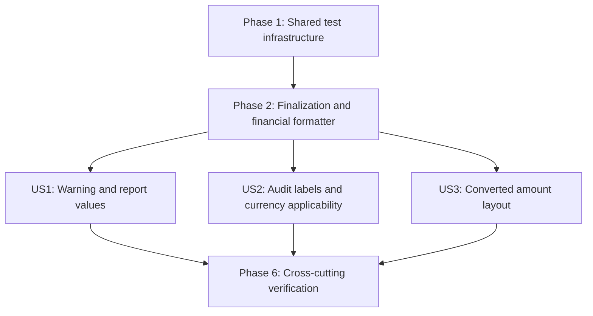

---

description: "Executable task list for final report presentation adjustments"
---

# Tasks: Final Report Adjustments

**Input**: Design documents from `/specs/009-final-report-adjustments/`

**Prerequisites**: `plan.md`, `spec.md`, `research.md`, `data-model.md`, `contracts/report-rendering.md`, and `quickstart.md`

**Tests and Quality Gates**: The feature specification explicitly requires automated package, unit, contract, integration, empirical-regression, and isolated performance evidence. New-behavior tests in each user-story phase must be written first and observed failing for the intended reason before implementation; characterization tests may pass while locking existing recovery behavior. Production statement, line, branch, and per-file coverage must remain 100%. The empirical dataset and generated oracle fixtures under `testdata/empirical/` are read-only.

**Organization**: Tasks are grouped by user story so each story can be implemented and tested independently after the shared prerequisites.

## Format: `[ID] [P?] [Story] Description`

- **[P]**: Can run in parallel after its stated prerequisites because it uses different files and does not depend on another incomplete task in the same wave
- **[Story]**: Maps a task to User Story 1, 2, or 3 from `spec.md`
- Every task names the exact source, test, or verification path it affects

## Phase 1: Setup (Shared Test Infrastructure)

**Purpose**: Establish reusable deterministic acceptance fixtures and concrete PDF inspection evidence needed by all three stories.

- [ ] T001 Resolve the conflict between FR-013's required present exact-zero unit price and the currently accepted all-monetary-values-missing reduction before fixing acceptance inputs: record one reviewed normative behavior and refreshed scope, constitution, calculation-regression, and security evidence in `specs/009-final-report-adjustments/spec.md`, `specs/009-final-report-adjustments/plan.md`, `specs/009-final-report-adjustments/research.md`, `specs/009-final-report-adjustments/data-model.md`, `specs/009-final-report-adjustments/contracts/report-rendering.md`, `specs/009-final-report-adjustments/quickstart.md`, and this `specs/009-final-report-adjustments/tasks.md`, then create the resulting closed case manifest, semantic occurrence keys, both-format attempts, and non-empty `A`, `W`, `V`, `M`, `Q`, `B`, `Z`, `N`, `C`, `P`, and `E` counters in `tests/testutil/report_presentation_fixtures.go` without changing `testdata/empirical/`
- [ ] T002 [P] Extend generated-PDF inspection with ordered text runs containing page number, decoded text, font resource, and text coordinates while preserving existing page-box and searchable-text behavior, and cover parsing/error branches in `tests/testutil/pdf_inspection.go` and `tests/testutil/pdf_inspection_test.go`

**Checkpoint**: Shared fixtures can identify every acceptance occurrence, and project-owned PDF inspection can prove font and vertical-position contracts.

---

## Phase 2: Foundational (Blocking Prerequisites)

**Purpose**: Add the error-returning PDF finalization seam and exact report-specific financial formatter required before any story implementation.

**CRITICAL**: Complete this phase before starting user-story implementation.

### Tests for Foundational Behavior

> Write these tests first. T003 and T005 must fail for the missing behavior; T004 characterizes existing runtime recovery and may pass before the finalization seam changes.

- [ ] T003 [P] Add failing package tests for PDF byte-finalization success and injected failure, including normal error return, discarded partial bytes, no process termination, and no successful payload in `internal/report/pdf/renderer_internal_test.go`
- [ ] T004 [P] Add runtime-service characterization tests proving a render or finalization error invokes neither the bundle writer, opener, nor alternate-format renderer, reports no successful document or path, returns redacted contextual failure text, and permits a successful second attempt through the same service in `internal/app/runtime/report_service_internal_test.go`
- [ ] T005 [P] Add exhaustive failing tests for scale-2 HALF UP formatting, signed and non-negative vectors, nil preservation, negative-zero normalization, source immutability, accepted adjusted-exponent bounds, upper-bound carry rejection, checked `uint32` precision arithmetic, non-finite values, and unexpected decimal conditions in `internal/report/presentation/financial_test.go`

### Implementation for Foundational Behavior

- [ ] T006 [P] Change `pdfLayoutDocument.Bytes` to return `([]byte, error)`, finalize through `GetBytesPdfReturnErr`, and propagate contextual finalization errors from `Renderer.Render` in `internal/report/pdf/layout_contract.go`, `internal/report/pdf/gopdf_document.go`, and `internal/report/pdf/renderer.go`
- [ ] T007 [P] Implement report-domain financial and optional-financial formatting from defensive `apd.Decimal` copies at exponent `-2` with `apd.RoundHalfUp`, checked precision/exponent guards, accepted condition masks, fixed-point grammar, and unsigned zero output in `internal/report/presentation/financial.go`

**Checkpoint**: PDF finalization cannot terminate the process, and both renderers can derive exact two-place financial strings without mutating calculated values.

---

## Phase 3: User Story 1 - Read Release-Ready Report Values (Priority: P1) MVP

**Goal**: Add the exact fully bold legal-use warning and apply two-place HALF UP presentation to every visible amount and unit price while preserving quantities, rates, currencies, calculations, and exact inclusion decisions.

**Independent Test**: Generate the same representative calculated report as Markdown and PDF with the complete financial matrix, quantity vectors, and normalized rate vectors. Verify the warning exactly once between metadata and summary, every present amount and unit price at two places, nil values blank, quantities and rates canonical, source models unchanged, and out-of-domain values rejected before output.

### Tests for User Story 1

> Write these tests first and verify they fail for the missing warning or presentation behavior.

- [ ] T008 [P] [US1] Extend shared-row tests across every activity, liquidation, Annex, and conversion monetary field while proving optional blanks, exact-zero decisions, canonical quantities and rates, contextual errors, and unchanged source decimals in `internal/report/presentation/rows_test.go`
- [ ] T009 [P] [US1] Add Markdown package and black-box tests for the exact one-line bold warning, semantic placement, every direct and row-built financial field, matrix vectors, blank optionals, unchanged quantities/rates, and render failures in `internal/report/markdown/renderer_internal_test.go` and `tests/unit/report_markdown_test.go`
- [ ] T010 [P] [US1] Add PDF recorder tests for metadata-warning-summary operation order, a dedicated fully bold wrapped-warning operation, exact semantic cells, direct and row-built matrix values, unchanged quantities/rates, and layout-operation error propagation in `internal/report/pdf/renderer_internal_test.go`
- [ ] T011 [P] [US1] Add closed-manifest contract coverage for `W`, `V`, `Q`, and US1 parity items, update invalidated legacy Markdown/Annex value assertions, and verify exact fields, PDF text-run font evidence through the final warning period, both-format FR-004a rejection, population numerator/denominator reporting, and searchable/selectable content in `tests/contract/report_rendering_values_contract_test.go`, `tests/contract/markdown_report_contract_test.go`, and `tests/contract/report_annex_contract_test.go`
- [ ] T012 [P] [US1] Add runtime-backed same-cache Markdown/PDF generation checks with pre-render and post-render AUD-001 model equality for financial values, quantities, rates, rate metadata, currencies, inclusion states, and output bundle shapes, and update only invalidated rendered-value assertions before source changes in `tests/integration/report_value_presentation_flow_test.go`, `tests/integration/report_generation_flow_test.go`, `tests/integration/report_failure_flow_test.go`, and `tests/integration/report_cost_basis_methods_flow_test.go`

### Implementation for User Story 1

- [ ] T013 [P] [US1] Define the exact shared legal-use warning and emit it once as a standalone bold Markdown paragraph after report metadata and before the summary, excluding the separate Annex, in `internal/report/presentation/legal_warning.go` and `internal/report/markdown/renderer.go`
- [ ] T014 [P] [US1] Add a dedicated bold wrapped-paragraph operation with measured vertical advance and complete bold-font use to the PDF layout contract and concrete adapter in `internal/report/pdf/layout_contract.go` and `internal/report/pdf/gopdf_document.go`
- [ ] T015 [P] [US1] Replace canonical monetary rendering with the shared financial formatter for activity, liquidation, Annex activity, and converted amount values while retaining canonical quantity/rate handling and contextual field errors in `internal/report/presentation/rows.go`
- [ ] T016 [P] [US1] Apply shared financial formatting to Markdown summary totals and position cost bases, keep summary inclusion based on the exact decimal sign, and retain canonical position quantities in `internal/report/markdown/renderer_summary.go` and `internal/report/markdown/renderer_details.go`
- [ ] T017 [US1] Insert the shared warning through the bold PDF operation and apply shared financial formatting to PDF summary totals and position cost bases while keeping exact-sign inclusion and canonical quantities in `internal/report/pdf/main_report.go`

**Checkpoint**: User Story 1 passes independently in both formats and is the suggested MVP implementation/demo slice; it is not merge- or release-complete until the full selected feature and required cross-cutting gates pass.

---

## Phase 4: User Story 2 - Interpret Audit Values Clearly (Priority: P2)

**Goal**: Render structured Annex booleans as `Yes` or `No` and suppress only the visible original currency for an exact pre-format zero-priced holding reduction.

**Independent Test**: Generate both formats with true and false liquidation states plus zero-priced, non-zero-priced, tiny-positive, same-tier-derived-positive, missing-price, and contradictory-source-field controls. Verify the labels, blank/retained original currency, retained calculation currency, and unchanged pre-format audit model.

### Tests for User Story 2

> Write these tests first and verify they fail for missing classification propagation or incorrect visible labels/currency.

- [ ] T018 [P] [US2] Add exact source-price predicate tests for the reviewed T001 behavior, zero scale/sign variants, missing values, tiny positive values, same-tier derivation, non-empty explanations, nonnegative post-reduction holdings, and contradictory non-zero source fields in `internal/report/calculate/activity_input_internal_test.go`, `internal/sync/validate/activity_history_internal_test.go`, and `tests/unit/report_activity_input_test.go`
- [ ] T019 [P] [US2] Add tests proving `AuditActivityEntry` receives and clones the inherited zero-priced classification while retaining its pre-format `ActivityCurrency` and every other audit value in `internal/report/calculate/calculator_internal_test.go` and `internal/report/model/report_internal_test.go`
- [ ] T020 [US2] Add shared-row and Markdown renderer tests for exact `Yes`/`No` mapping, direct consumption of the shared label, and blank-only-when-classified original currency while calculation currency and tiny-positive controls remain visible in `internal/report/presentation/rows_test.go` and `internal/report/markdown/renderer_internal_test.go`
- [ ] T021 [US2] Extend generated Markdown and concrete PDF Annex contracts for both boolean states and all `Z`/`N` currency controls, including non-empty population counts and no lowercase boolean field values, in `tests/contract/report_annex_contract_test.go`
- [ ] T022 [P] [US2] Add runtime-backed Annex parity and AUD-001 equality checks proving only the visible classified currency cell is suppressed and the calculated audit currency/classification remain unchanged in `tests/integration/report_audit_presentation_flow_test.go`

### Implementation for User Story 2

- [ ] T023 [P] [US2] Add the transient `IsZeroPricedHoldingReduction` classification to `AuditActivityEntry` without adding persistence or unrelated validation and preserve it through defensive copies in `internal/report/model/audit_activity_entry.go`
- [ ] T024 [US2] Implement the reviewed T001 zero-priced holding-reduction predicate without changing basis, conversion, gain/loss, currency identity, or activity inclusion beyond the explicitly revised applicability contract, then copy that exact classification into each calculated audit entry while retaining the existing activity-currency value and all financial evidence in `internal/report/calculate/activity_input.go` and `internal/report/calculate/artifacts.go`
- [ ] T025 [US2] Derive `Yes`/`No` and the classified visible-currency blank in the shared Annex row, then make Markdown consume the shared boolean label directly without `%t` conversion in `internal/report/presentation/rows.go` and `internal/report/markdown/renderer_annex.go`

**Checkpoint**: User Story 2 passes independently with the reviewed predicate applicability from T018 and no unapproved basis, conversion, gain/loss, persistence, source-currency inference, or activity-inclusion change.

---

## Phase 5: User Story 3 - Scan Converted Amounts (Priority: P3)

**Goal**: Present every included converted amount as one ordered logical entry with exact spacing and a renderer-controlled line boundary, including correct PDF measurement and whole-row pagination.

**Independent Test**: Generate both formats for all eight canonical zero-to-three-entry subsequences plus received duplicate/non-canonical supported-kind sequences and long wrapped entries. Verify exact omission/order/grammar, Markdown `;<br>` boundaries, PDF later vertical starts, matching measured/drawn wraps, whole-row fresh-page movement, and overheight failure before finalization or save.

### Tests for User Story 3

> Write these tests first and verify they fail for inline separators, flattened newlines, or incorrect PDF preflight.

- [ ] T026 [P] [US3] Add presentation tests for all eight canonical subsequences, exact zero-to-zero omission, inclusion of non-zero values displayed as `0.00`, received duplicate/non-canonical supported-kind order, component errors, and immutable source sequences in `internal/report/presentation/converted_amounts_test.go`
- [ ] T027 [US3] Add Markdown tests for empty/single/multiple entries, exact colon-arrow-semicolon spacing, controlled `;<br>` boundaries, valid one-row pipe tables, and component-level HTML/table-delimiter escaping before renderer delimiters in `internal/report/markdown/renderer_internal_test.go`
- [ ] T028 [US3] Add PDF tests for explicit-newline and long-space wrapping equivalence, measured/drawn line counts, row heights, bottom margins, pre-draw fresh-page movement, repeated continuation context/header, overheight failure without looping/finalization, measurement/drawing errors, dynamic newline/delimiter injection, and preservation of generic single-line sanitization in `internal/report/pdf/renderer_internal_test.go`
- [ ] T029 [US3] Add concrete Markdown/PDF contracts for the `C` and `E` populations, all eight subsequences, updated legacy inline-conversion assertions, exact semantic cells, one logical start per included entry, later PDF Y coordinates, preserved order, and complete searchable text in `tests/contract/report_converted_amounts_contract_test.go` and `tests/contract/report_annex_contract_test.go`
- [ ] T030 [P] [US3] Add runtime-backed both-format parity, AUD-001 model immutability, renderer call-count/no-alternate-format assertions, no-output/no-opener failure checks, and a successful second attempt after multiline PDF layout failure in `tests/integration/report_converted_amounts_flow_test.go`

### Implementation for User Story 3

- [ ] T031 [US3] Replace the delimiter-bearing converted-amount string with ordered logical entries that use the shared financial formatter, omit only exact zero-to-zero pairs, preserve every received supported-kind sequence, and add no list-level validation in `internal/report/presentation/rows.go` and `internal/report/presentation/converted_amounts.go`
- [ ] T032 [P] [US3] Escape each dynamic Markdown converted-entry component before fixed syntax assembly and join sanitized logical entries with `;<br>` while leaving empty and singleton cells delimiter-free in `internal/report/markdown/renderer_conversion.go` and `internal/report/markdown/renderer_format.go`
- [ ] T033 [P] [US3] Preserve only renderer-controlled converted-entry newlines through a dedicated PDF cell sanitizer and join logical entries with `;\n` without weakening generic single-line sanitization in `internal/report/pdf/annex_report.go` and `internal/report/pdf/presentation.go`
- [ ] T034 [US3] Measure table cells by `SplitTextWithOption` plus `IsFitMultiCellWithNewline` using the same indicator-sensitive space-break policy as drawing, then preflight and draw each complete row against remaining and fresh-page capacity with contextual overheight errors in `internal/report/pdf/gopdf_seams.go`, `internal/report/pdf/gopdf_document.go`, and `internal/report/pdf/gopdf_table.go`

**Checkpoint**: All three stories are independently functional, and converted audit rows remain readable and whole across PDF pages.

---

## Phase 6: Polish & Cross-Cutting Concerns

**Purpose**: Complete failure recovery, confidentiality, regression, scale, coverage, quality, and manual readability evidence across all stories.

- [ ] T035 [P] Complete output-transaction regression cases for Markdown second-path reservation and write/sync/close/validation/bundle failures, PDF write/sync/close/validation/bundle failures, `0600` reservation, collision sentinel retention, current-attempt-only cleanup, no partial saved paths, and opener-warning file retention in `internal/report/output/writer_internal_test.go` and `tests/contract/report_output_contract_test.go`
- [ ] T036 [P] Add SEC-001 sentinels covering successful documents, returned and wrapped render errors, diagnostics, examples, and generated fixtures while proving controlled Markdown/PDF delimiters cannot be injected by dynamic values in `tests/contract/report_rendering_confidentiality_test.go`
- [ ] T037 [P] Update the isolated scale scenario to assert the exact 10,000-activity/two-asset/three-currency composition, 6,666 three-entry conversion rows in each format, separate sub-two-minute timers, multiline PDF continuation pages, repeated context/header, complete entries, and recorded environment data in `tests/performance/helpers_test.go` and `tests/performance/report_performance_flow_test.go`
- [ ] T038 [P] Freeze the fully qualified top-level and leaf-subtest IDs plus comparable exact calculated-result and expected-fixture fingerprints from baseline `b7de13e597332ca8a1c36af3e05685217ab25f18`, add an automated current-tree comparison that fails missing/renamed cases or changed baseline financial expectations and reports the `R` numerator/denominator for `internal/report/basis/`, `internal/report/calculate/`, and `tests/empirical/`, and confirm empirical fixtures are unchanged in `tests/contract/testdata/report_calculation_regression_baseline.txt` and `tests/contract/report_calculation_regression_contract_test.go`
- [ ] T039 Add aggregate acceptance accounting that executes both format attempts for every closed `A` case, retains failed attempts in every applicable denominator, fails missing/extra/empty populations, and reports numerators and denominators for `A`, `W`, `V`, `R`, `M`, `Q`, `B`, `Z`, `N`, `C`, `P`, and `E` in `tests/contract/report_rendering_acceptance_test.go`
- [ ] T040 Apply `gofmt`, required Go documentation, and OpenCode co-authoring metadata to every agent-touched Go declaration, including the T038-T039 acceptance harnesses, without changing unrelated code in `internal/report/presentation/`, `internal/report/markdown/`, `internal/report/pdf/`, `internal/report/model/`, `internal/report/calculate/`, `internal/app/runtime/`, `tests/`, and `tests/contract/`
- [ ] T041 Run the focused verification command from `specs/009-final-report-adjustments/quickstart.md` against `internal/report/model/`, `internal/report/calculate/`, `internal/report/presentation/`, `internal/report/markdown/`, `internal/report/pdf/`, and `tests/testutil/`, then fix every failure
- [ ] T042 Run the full deterministic `make test` aggregate for `cmd/`, `internal/`, `tests/unit/`, `tests/contract/`, `tests/integration/`, `tests/empirical/`, and `tools/`, then fix every failure
- [ ] T043 Run `make coverage` and restore canonical 100% statement, global line, global branch, per-file line, and per-file branch coverage for changed production files under `cmd/` and `internal/`
- [ ] T044 Run `make test-performance` for `tests/performance/`, verify each selected-format generation is strictly under two minutes with all SC-011 pagination/content assertions, keep performance evidence out of `dist/coverage.out`, and require or cite the authoritative successful `test-performance / run` Ubuntu check unless the local environment records equivalent runner conditions
- [ ] T045 Run `make quality QUALITY_BASE_REF=origin/main`, fix changed-source findings, and confirm `go.mod` and `go.sum` have no dependency changes; if pinned local capabilities are insufficient, stop under DEP-001 and revise `specs/009-final-report-adjustments/research.md`, `plan.md`, `spec.md`, and this `tasks.md` before continuing
- [ ] T046 Execute the generated Markdown/PDF readability, selectable-text, warning, multiline-row, bottom-margin, local-only rendering, and security review in `specs/009-final-report-adjustments/quickstart.md` without claiming the ACC-002-excluded accessibility capabilities

**Checkpoint**: All required local gates pass, acceptance populations are reported and non-empty, no empirical fixture or dependency changed, and manual inspection agrees with automated evidence.

---

## Dependencies & Execution Order

### Phase Dependencies

- **Setup (Phase 1)**: No dependencies. T001 is the blocking predicate-design and acceptance-manifest task; the PDF-inspector work in T002 is independent and may proceed concurrently.
- **Foundational (Phase 2)**: Depends on Setup. T003, T004, and T005 are the failing-test wave. T006 and T007 can then proceed concurrently after their matching tests exist.
- **User Stories (Phases 3-5)**: Each depends on Foundational. The stories have no semantic dependency on one another and remain independently testable.
- **Polish (Phase 6)**: Depends on every story selected for delivery. T035, T036, T037, and T038 can proceed concurrently; T039 aggregates their evidence, T040 formats all touched Go files, and T041-T046 are the sequential final gates.

### User Story Dependency Graph



### User Story Coordination Constraints

- **US1**: Starts after T006 and T007. T017 depends on both the shared warning from T013 and the PDF bold operation from T014. All US1 acceptance tests pass after T013-T017.
- **US2**: Starts after T006 and T007. T024 depends on T023, and T025 depends on the classification field from T023. It does not require US1 behavior.
- **US3**: Starts after T006 and T007. T032, T033, and T034 depend on the logical-entry representation from T031. It does not require US1 or US2 behavior.
- **Shared-file coordination**: Serialize T015/T025/T031 for `internal/report/presentation/rows.go`, T008/T020 for `internal/report/presentation/rows_test.go`, T009/T020/T027 for `internal/report/markdown/renderer_internal_test.go`, T010/T028 for `internal/report/pdf/renderer_internal_test.go`, T011/T021/T029 for `tests/contract/report_annex_contract_test.go`, and T014/T034 for `internal/report/pdf/gopdf_document.go` when stories are assigned concurrently.

### Within Each User Story

- Write and observe the story tests failing before implementation.
- Preserve exact model decisions before deriving visible strings.
- Implement format-neutral presentation before renderer-specific syntax or layout.
- Run the story's package, contract, and integration tests before its checkpoint.
- Do not mutate `testdata/empirical/`, add dependencies, or introduce network rendering.

---

## Parallel Execution Examples

### User Story 1

```text
Test wave: T008 || T009 || T010 || T011 || T012
Implementation wave: T013 || T014 || T015 || T016
Dependent implementation: (T013 && T014) -> T017
Validation wave: run all US1 package, contract, and integration tests together
```

### User Story 2

```text
Independent test wave after the T001 design gate: T018 || T019 || T022
Coordinated shared-test sequence: T020 -> T021
Implementation wave: T023
Dependent implementation: T023 -> T024 -> T025
Validation wave: run all US2 calculation, presentation, contract, and integration tests together
```

### User Story 3

```text
Independent test wave: T026 || T030
Coordinated shared-test sequence: T027 -> T028 -> T029
Shared implementation: T031
Renderer/layout wave: T031 -> (T032 || T033) -> T034
Validation wave: run all US3 presentation, renderer, contract, and integration tests together
```

---

## Implementation Strategy

### MVP First: User Story 1 Validation Slice

1. Complete T001-T002 for deterministic acceptance and PDF inspection support.
2. Complete T003-T007 for safe PDF finalization and exact display formatting.
3. Complete T008-T017 for the warning and release-ready values.
4. Stop and validate User Story 1 independently in both formats.
5. Run T035, T036, T038, T041, T042, T043, T045, and the US1 portions of T046, and apply `gofmt` to the US1 paths without marking full-feature T040 complete, before demonstrating the MVP slice.
6. Do not merge or release the feature until T018-T046 and every full-feature gate are complete.

### Incremental Delivery

1. Complete Setup plus Foundational as internal prerequisites with no visible calculation change.
2. Validate User Story 1 as the MVP warning and financial-value presentation increment.
3. Validate User Story 2 as the independently tested Annex audit-semantics increment.
4. Validate User Story 3 as the independently tested multiline conversion-layout increment.
5. Complete Phase 6 and accept the feature only after all selected story and cross-cutting gates pass.

### Parallel Team Strategy

1. Complete shared Setup and Foundational tasks together.
2. Assign one worker per story for story-specific tests and non-conflicting source files.
3. Serialize the explicitly listed shared-file tasks or coordinate them in one work unit.
4. Merge story increments only after each independent test criterion passes.

---

## Notes

- `[P]` marks only tasks safe to run concurrently after their explicit prerequisites.
- Story labels provide traceability to the three prioritized scenarios in `spec.md`.
- Every rendering error must remain contextual, actionable, and non-secret.
- Quantities and disclosed rates never use the two-decimal financial formatter.
- Exact values, not visible `0.00` strings, control omission, inclusion, and classification.
- The output writer remains the sole owner of reservation, `0600` mode, cleanup, bundle completion, and opener warnings.
- Stop under DEP-001 rather than adding a dependency, external binary, browser, platform service, remote renderer, network path, or weakened requirement.
